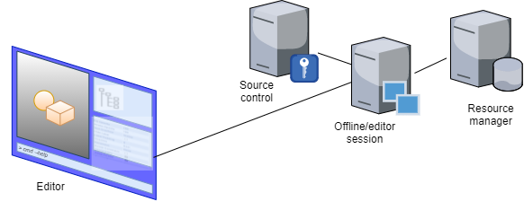

# High level flows

The following use cases will help contextualize and understand the overall flow between the different applications making up the Legion engine and its client applications.

> Some paragraphs are prefixed with the 👍/👎 symbol to indicate that they are still are undecided and need to be confirmed.

> The ❓ prefix is used to indicate that some information is missing, and needs to be clarified.

## Game production / development

The Legion engine provides a full production pipeline for the creation of games and interactive environments.

In these game production scenarios, the user is part of the game development team in a company that is a client of Legion Labs.

### Startup sequence

The user starts up the Legion Labs editor.

👍/👎 The editor will be accessible as either a light-weight client application, or through a web browser. Whichever the case, its contents will be streamed from Legion Labs servers.

If accessing for the first time, the user must first select which project to work on (the company could be working on several titles), and then which specific world within the project to open. If returning, the settings will default to the values from the previous session.

> If a project contains a single world, or has a base root world, it will be selected by default.

The editor will then open up and be ready for the user to browse and edit the world's contents.

### Collaboration

By choosing to use shared virtual workspaces, users have the advantage of always seeing the latest changes from their team.

❓ How are shared workspaces created and shared?

### Importing source data

Many types of resources will be edited outside of the Legion Labs editor.

This includes (but is not limited to):
* Textures
* Visual meshes
* Animations
* Sound

These will be created and edited in dedicated applications, such as Autodesk Maya or 3D Studio Max for visual meshes, and then imported into the source-control system.

A DCC (*Digital Content Creator*) importer, one per resource type, will convert the data to an offline format that is usable in the editor.

Users can also import data from external content management systems such as [Quixel Bridge](https://help.quixel.com/hc/en-us/articles/115000613105-What-is-Quixel-Bridge-).

Changes in source data (external formats) will trigger an update of the offline data.

### Entities and components

The basic game element is called an entity. An entity can represent many things: the player, a static object such as a house, a projectile, etc.

Users flesh out entities by attaching various components to them in the editor. A component collects different parameters related to a given domain. For example, a visual component would describe the look of an entity, possibly using a mesh and a material. A physics component would contain physical properties such its mass.

In the editor's scene view, users can select an entity to display its components in a property grid. The editor also has an entity browser that allows users to explore the entities and their relationships.

### Scripting game logic

In order to specify behavior associated with game assets/entities, users can use a scripting language.

To do so, the user must start by associating a game logic component to an entity. An editable script is then made available.

❓ How are scripts edited? Is there a visual programming interface, or rather some way of invoking an external IDE such as [Visual Studio Code](https://code.visualstudio.com/)?

### Testing changes

At any time, users can launch a play session from the editor. This will open up a new viewport in which allows interactions with a running game engine.

The engine will used compiled runtime data, that contains all the changes local to the shared virtual workspace.

👍/👎 The game session can also be joined by other users, allowing multiplayer interactions.

Other than savegames, these game sessions do not persist data. Any changes to the game environment, such as destruction effects for example, will not affect the offline data and remain circumscribed to the lifetime of the game session.

👍/👎 When offline data is modified, either directly in the editor or when associated source data gets updated, this in turn will incrementally recompile the runtime data. Updated runtime data will be hot-reloaded in active game sessions.

### Production analytics

Users can consult dashboards that show various production metrics, such as
* test coverage
* performance heatmaps
* % usage of placeholder data

### Outsourcing

There are many scenarios in which some work during game production is shared with external partners.

Small teams may not have all the required talent in-house. A team might need some extra help during some milestones. Compliancy testing, or localization, might be contracted out to an external firm.

Given that the editor streams all of its data from a centralized service, the production pipeline is well suited to these outsourcing scenarios. Once access rights have been configured appropriately, deployment is straightforward.

## Game live operations

Once a game has finished its initial production phase and is ready to be launched, it needs to be packaged for distribution. This can happen also for releases of title updates, and for regular maintenance of live games.

### Packaging a release

Games can be packaged and delivered in different configurations, according to their target audience:

* Stand-alone game clients, which are self-contained. Everything is bundled together in the game package (data, logic, etc). A different package is generated for each targeted hardware platform.
* Local clients, which are similar to stand-alone clients except that some of the game logic resides in back-end services. A multiplayer game would likely fit with this configuration.
* Streaming clients that connect to a back-end streaming session. These clients will collect all local input (game controllers, voice, etc) and display rendered output (visuals, audio, etc).

### First party submissions

!todo
