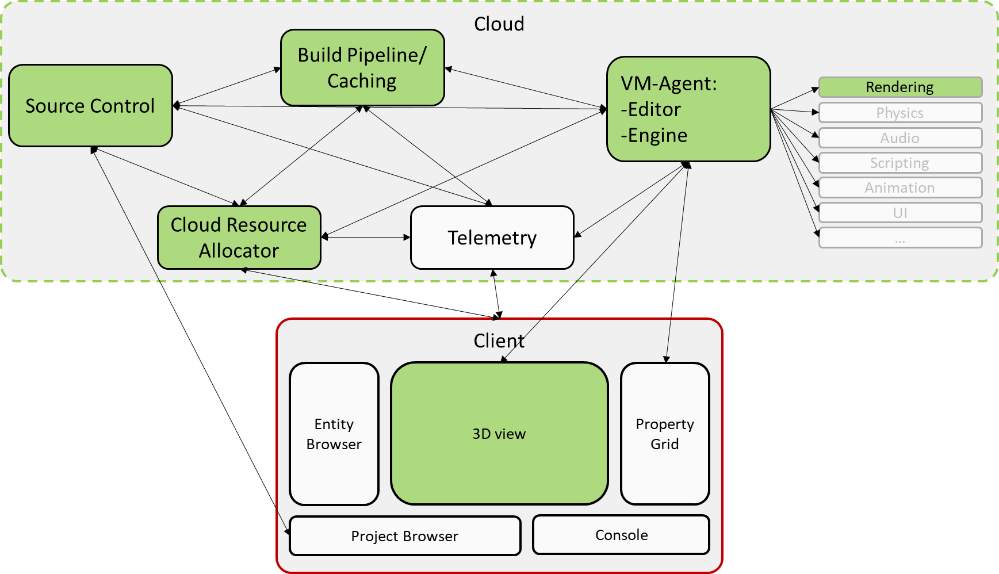

# High Level Objectives

The primary Legion's focus over the next 24 since starting the company is to focus on a battery included production process, meaning whatever is involved in the interaction with the engine during production, for a designer tweaking some values and testing it locally, to him sharing his change to a couple of people to give their feedback, to submit their change and have an official build tested on the production floor. (Production floor is virtual in this instance, it can span over continents).
Our target is to acheive such loops in matter of minutes if not seconds. 

## 24 Months

The 24 months involves implementing all the components involved in the loop above in such a manner that we can demo it's value to external people:

## 6 Months

The 6 month objective allows us to have a full working loop with a basic implementation of the above components: 

## Github Projects

We track the advancement of our releases and tasks through our [github issues](https://github.com/legion-labs/legion/issues).

