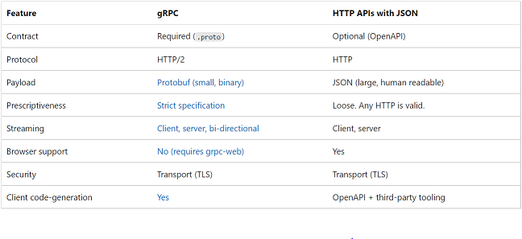
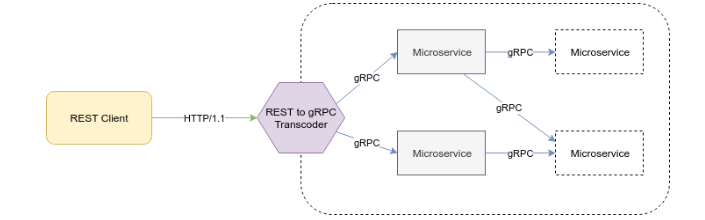

# GRPC to REST/OpenAPI based services

## What are the needs ?

- Expose backend APIs that are accessible by all the different client types, standalone and web clients.
- Use a rust framework/crate that can ideally provide the following components:
  - Code generation for both service and client based on an API contract.
  - Easy to use and feature rich.
  - Support for async/await.
  - Compatible with our `tokio` runtime stack.
  - Potentially based on the HTTP client `hyper` we already use.
  - Ideally low amount of dependencies.

[gRPC and HTTP APIs Comparison:](https://docs.microsoft.com/en-us/aspnet/core/grpc/comparison)



## GRPC (`tonic`):

### PROS

- Provides Rust code generation.
- Performant gRPC protocol based on protobuf (binary message format).

### CONS

- Different protocols for web (grpc-web on HTTP/1.1 & 2) and standalone clients (HTTP/2) (need two load balancers).
- Rust gRPC implementation `tonic` is powerful but complex.

## REST APIs

### PROS

- Widely used OpenAPI specification with universal browser support.
- Lots of tooling available in many languages.
- Human readable JSON format.

### CONS

- Verbose specification for all API endpoints.
- No built-in code generation.
- No built-in security.

## WEB FRAMEWORKS

Some interesting links about the available Rust web frameworks:

[https://www.arewewebyet.org/topics/frameworks/](https://www.arewewebyet.org/topics/frameworks/)

[https://kerkour.com/rust-web-framework-2022](https://kerkour.com/rust-web-framework-2022)

Based on multiple benchmarks the performance of `Actix-Web` seems to be the best but `Warp` and `Axum` are very close.
We do not consider this difference as a major argument considering the low frequency requests we will expect on our services.

[https://github.com/programatik29/rust-web-benchmarks/blob/master/result/hello-world/hello-world.md](https://github.com/programatik29/rust-web-benchmarks/blob/master/result/hello-world/hello-world.md)

[https://web-frameworks-benchmark.netlify.app/result?l=rust](https://web-frameworks-benchmark.netlify.app/result?l=rust)

### [Actix-Web](https://github.com/actix/actix-web) (13.9k stars)

This [crate](https://github.com/openapi/actix-swagger) provides a swagger code generator for actix-web.

Web server framework based on `tokio`.

```rust
#[derive(Debug, Serialize, Deserialize)]
struct Hello {
    message: String,
}

async fn index(item: web::Json<Hello>) -> HttpResponse {
    HttpResponse::Ok().json(item.message) // <- send response
}

#[actix_web::main]
async fn main() -> std::io::Result<()> {
    HttpServer::new(|| {
        App::new()
            .service(web::resource("/").route(web::post().to(index)))
    })
    .bind(("127.0.0.1", 8080))?
    .run()
    .await
}
```

PROS:

- One of the most used web framework, a lot of resources.
- The best in class performance-wise according to some benchmarks.

CONS:

- Custom actix stack (not `hyper`).
- Not compatible with `tower`.
- Heavier library.
- Controversies in the past related to the use of unsafe code (main maintainer left).

### [Warp](https://github.com/seanmonstar/warp) (6.3k stars)

Web server framework based on `hyper` and `tokio`.

```rust
#[derive(Debug, Serialize, Deserialize)]
struct Hello {
    message: String,
}

async fn index(item: Hello) -> Result<impl warp::Reply, Infallible> {
    Ok(warp::reply::json(&hello.message))
}

#[tokio::main]
async fn main() {
    let promote = warp::post()
        .and(warp::body::json())
        .map(index);

    warp::serve(promote).run(([127, 0, 0, 1], 8080)).await
}
```

PROS:

- Powerful chaining of filters / handlers.
- Compatible with `tower`.

CONS:

- The Rejection system in warp doesn't play nicely with Result<> ([#712](https://github.com/seanmonstar/warp/issues/712))
- Harder to get used to (at least personally).

### [Axum](https://github.com/tokio-rs/axum/) (4.4k stars)

axum is a web application framework built on top of `hyper` by the `tokio` team.

```rust
#[derive(Debug, Serialize, Deserialize)]
struct Hello {
    message: String,
}

async fn index(item: Json<Hello>) ->impl IntoResponse { {
    Json(item.message)
}

#[tokio::main]
async fn main() {
    let app = Router::new().route("/", post(index));

    let addr = SocketAddr::from(([127, 0, 0, 1], 8080));
    axum::Server::bind(&addr)
        .serve(app.into_make_service())
        .await
        .unwrap();
}
```

PROS:

- Compatible with `tower`.
- Clean and easy to use API.
- Creators of `tokio`.
- Lightweight.

CONS:

- Still young project and community.
- Not the best available performance wise.

### [Rocket](https://github.com/SergioBenitez/Rocket) (17k stars)

One of the most used and first web framework fur Rust.

PROS:

- Huge community and resources.
- Simple syntax, heavily based on macros.
- Good requests parameters parsing capabilities.

CONS:

- 0.4.x version has no async/await.
- 0.5 version still in RC and it seems no release was made since June 2021.

### [Poem](https://github.com/poem-web/poem) (1.3k stars)

Web framework that seem very young without much documentation.

## Tools

### [gRPC-Gateway](https://github.com/grpc-ecosystem/grpc-gateway) (13.1k stars)



[source](https://www.redhat.com/en/blog/comparing-openapi-grpc)

Provides a way to read protobuf service definitions and generate a reverse-proxy server which translates a RESTful HTTP API into gRPC (see [maintainer's blog post](https://jbrandhorst.com/post/grpc-in-the-browser/)).
Looks nice when forced to provide both type of APIs for backward-compatibility or performance for example but not very useful in our case, it might add more complexity than real benefit.

### [OpenAPIv3](https://crates.io/crates/openapiv3)

Provides Rust data structures for the OpenAPI v3.0.x specification.

### [OpenAPI Generator](https://github.com/OpenAPITools/openapi-generator) (11.8k stars)

Tooling for the generation of API client libraries and server stubs for different languages including Rust based on `moustache` templates.

### [Paperclip](https://github.com/paperclip-rs/paperclip) (500 stars)

OpenAPI code generator for Rust written in Rust. Make use of println instead of relying on a template engine.

### [Tera](https://github.com/Keats/tera) (2k stars)

Tera is a template engine. It uses a hashmap as input for its templates.

```rust
use tera::Context;

#[derive(Serialize)]
struct Product {
    name: String
}

// Using the tera Context struct
let mut context = Context::new();
context.insert("product", &product);
context.insert("vat_rate", &0.20);

tera.render("products/product.html", &context)?;

// or a struct
tera.render("products/product.html", &Context::from_serialize(&product)?)?;
```

### [Askama](https://github.com/djc/askama) (1.7k stars)

Askama is a template engine. It uses custom struct as input for its template, which provide more type safety.
It seems to better handle its dependencies tree compared to `Tera`.

```rust
use askama::Template; // bring trait in scope

#[derive(Template)] // this will generate the code...
#[template(path = "hello.html")] // using the template in this path, relative
                                 // to the `templates` dir in the crate root
struct HelloTemplate<'a> { // the name of the struct can be anything
    name: &'a str, // the field name should match the variable name
                   // in your template
}

fn main() {
    let hello = HelloTemplate { name: "world" }; // instantiate your struct
    println!("{}", hello.render().unwrap()); // then render it.
}
```

## Questions

### 1. Should we rely on an hybrid approach where services could communicate with gRPC in the cluster but also expose REST APIs ?

Probably not, gRPC was first picked because we tought we could use that protocol across all services and clients. Turns out this is not the case, so we will use REST/OpenAPI instead of having too many protocols and complexity.

### 2. Should we use API first definitions and generate all Rust code accordingly or the other way around ? See (https://github.com/tokio-rs/axum/issues/50)

There seems to be a lot of discussion about what approach is better, code or API first. Here are the pros and cons of going with API first:

PROS:

- Quality of code and security layers are guaranteed to be the same across all code.
- Breaking changes in APIs are more easily catched in the API specification than in the code.

CONS:

- Handlers implementation has to be surrounded by code region to avoid any override.
- The OpenAPI spec has to cover all types and variants (nullables for ex.) of the underlying code generation.

### 3. Should we rely on a higher web framework such as `axum` or should we directly use `hyper`?

If the higher level framework is well structured, modular and light it might be intereseting to not reinvent the wheel. These can provide a router mechanism as well as path, body, and query parsing capabilities.

### 4. On what OpenAPI version should we rely ? 2.0 (2014), 3.0 (2017) or 3.1 (2021) ?

Looks like the majority of APIs use either version 2.0 or 3.0 at the moment. Version 3.1 introduced some breaking changes and is still very young.

The [OpenAPIv3](https://crates.io/crates/openapiv3) crate supports version 3.0.x at the moment.

## Decision

- API first approach where we generate code from an OpenAPI v3.0 specification.
- Provide a code generation framework based on the `OpenAPIv3` and `Aksama` crates.
- Use the `Axum` web framework for the Rust templates, support for other languages will come later.
