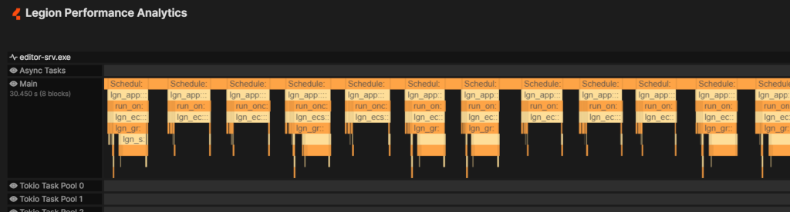
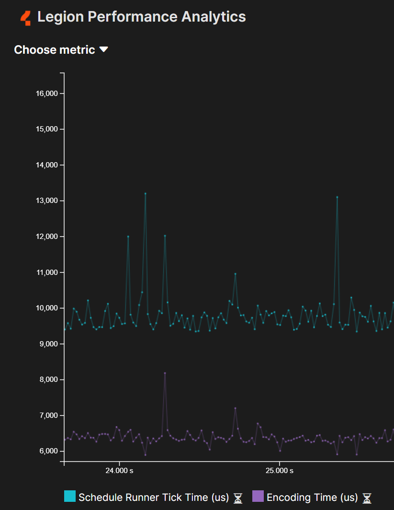
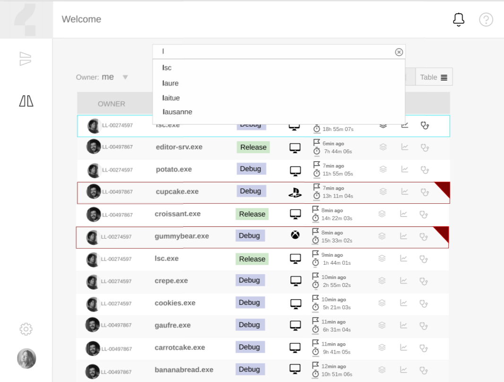
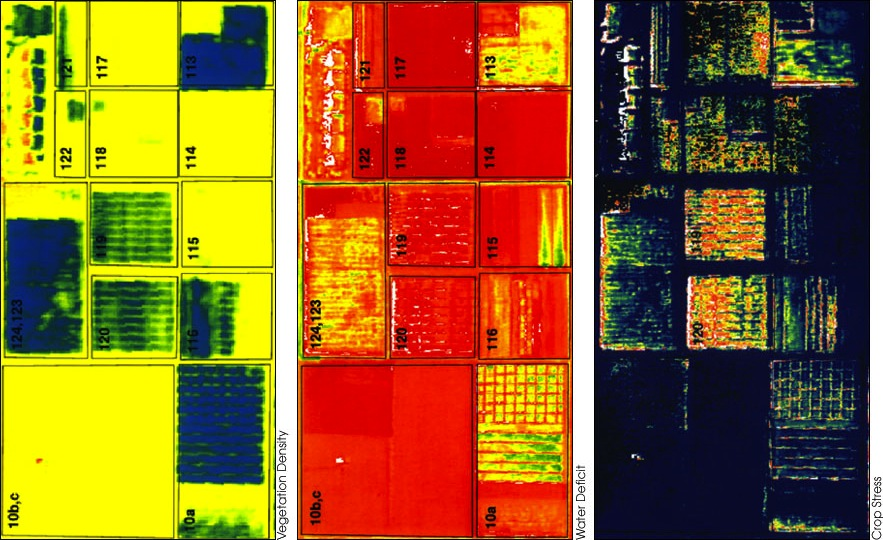

# Legion Performance Analytics

May 2022

---
# Legion Performance Analytics
- **Introduction**
- Requirements
- Architecture
- Progress & Roadmap

---

# Introduction
## Definition
- `Performance`: quantified non-functional requirement
- **The test of the machine is the satisfaction it gives you.**― Robert M. Pirsig, _Zen and the Art of Motorcycle Maintenance: An Inquiry Into Values_
- Performance for software
  - Latency
    * ex.: frame time, reaction time, replication time, load time
  - Stability
    * ex.: MTBF, crashes, error logs, memory use
  - Satisfaction
    * ex.: retention, engagement, biometrics, surveys

---

# Introduction
## Stages of data storage

- **in-app**: buffered streams of structured events
- **Data Lake**
  * write-friendly format
  * shallow index
- **Data Lakehouse**
  - deeply indexed
  - just-in-time
  - distributed query engine
  

---

# Introduction
## Levels of analytics

- in-app: HUD, adjust verbosity of telemetry
- Process stats: MTBF, max memory use, run time
- Deep inspection of a single session: Mem use of every asset, flame graphs for entire process
- Aggregates of high-frequency events over many sessions: Dashboards, Heat maps
---

# Legion Performance Analytics
- Introduction
- **Requirements and implications**
- Architecture
- Progress & Roadmap

---
# Requirements
## Frequency of events

- High Frequency: thousands of events per frame
  * begin/end function call: ~40 ns per event
  * begin/end asset-specific scope
  * memory alloc/free
  

  
---
# Requirements
## Frequency of events

- Frame Frequency
  * frame time, engine time, render sync
  * player health, #npcs
  * process memory allocated/available
  * i.e. mostly time series
  
---
# Requirements
## Frequency of events

- Process Frequency
  * begin/end app state (world loaded, in-play, matchmaking)
  * warnings, errors
  * crashes with callstack

---
# Requirements
## Generic and Extensible event stream format

- Open/Closed principle: open for extension, but closed for modification
- Adding a feature-specific event should have no impact on ingestion pipeline
- No magic: specific reports/views depend on the presence of specific events
  * tagging of streams to advertise the purpose/suitability
  * i.e. dynamic duck typing
- not limited to time series

---
# Requirements
## Generic and Extensible event stream format
### Performance characteristics
- write-friendly
  * most work is done with memcpy
  * important size optim: object references
- ingest-friendly
  * store without parsing whole block
  * compressed payload is not decompressed
- generic reader
  * as generic as JSON
  * metadata to decode the writer's memory model
---
# Requirements
## Understanding distributed applications

- Processes are part of a tree
- Track latency and stability across machines & architectures

---
# Requirements
## 5 views to rule over all data
### List / Table / Search

* recent processes
* top crashes
* cpu budget report
  
---

# Requirements
## 5 views to rule over all data
### Time series

* Individual frame times over time
* Player health over time
* Cohort engagement over 30 days

---
# Requirements
## 5 views to rule over all data
### Graphs & Trees

* Cumulative function call statistics
* Loaded object graph

---
# Requirements
## 5 views to rule over all data
### Timeline

* Function calls per thread
* Audio effects per stream

---
# Requirements
## 5 views to rule over all data
### Heatmap

* death map
* geographic slow frames distribution

---
# Requirements
## non-requirements

- interactive debugging
- per-pixel profiling
- low-level cpu events (L1 cache miss, branch mispredictions, ...)

## not yet
- Video streaming & overlay
- cpu sampling
- context switches

---
# Legion Performance Analytics
- Introduction
- Requirements
- **Architecture**
- Progress & Roadmap

---
# Architecture
## Object hierarchy

- Process
  - Stream
    - Event block
      - Event

---
# Architecture
## Online architecture

---
# Legion Performance Analytics
- Introduction
- Requirements
- Architecture
- **Progress & Roadmap**

---
# Progress 2021

<!--- (https://www.pngegg.com/en/png-zocmk)-->

## Halloween 2021

- Initial version of client telemetry library
- Local ingestion server (sqlite & files)
- CLI analytics (csv output)

## Christmas 2021
- Web Analytics client (svelte & Canvas)
- Visualization of call tree timeline

---
# Progress 2022

## January 2022
- Logging improvements, Timeline levels of details

## February 2022
- Cloud infra, Time series, UI redesign

## March 2022
- Time series & Timeline improvements, Async function tracing

---
# Progress 2022

## April 2022
- Unreal telemetry module (MAD)
- Cumulative call graph improvements (Tim)
- Timeline report view (Tim)
- Process List Hierarchy (Tim)
  * ordered by last update
- Auth flow polish (Kevin)

---
# Roadmap

## May 2022
- Unreal telemetry module (MAD)
- Review regulatory requirements (Liem)
- Infra visibility & alterting UAT (ingestion + analytics)(Liem)
- Logs (dual mode)  (Kevin)
  * Paging when not filtering
  * n-first results when there is a filter
- Lakehouse-backed timeline (MAD)

---
# Roadmap
## Juin 2022
- Lakehouse-backed timeline (continued) (MAD)
- Backups data lake (Liem)
- l10n/i18n (Kevin)
- API key refactor (Julien)
- IAM permissions cleanup for ingestion & analytics (Julien)
- TSC frequency calibration (MAD)

---
## Backlog

- Async spans stitching/LOD
- Memory tracing and analytics
- VM monitoring / Fluentd output command
- GPU profiling
- Support for Google Cloud Storage
- Landing page
- Object Graphs
  * Why is this texture loaded?
  
---
## More Backlog

- Process dashboards
  * monitoring thousands of processes
  * graphs of processes to lists of processes
- Task-based timeline & async span parenting
  * unifying thread-bound and async tasks
- Heat maps
- Real-time logs, metrics and timeline
  * block consolidation

---

