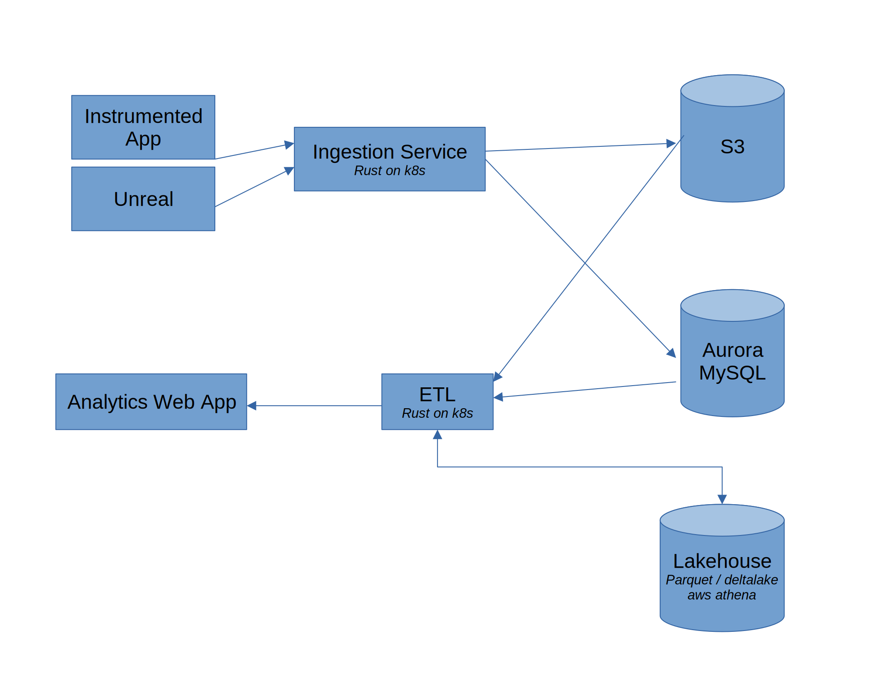

# Legion Performance Analytics
## Strategies and Tactics

May 2022

---
# Legion Performance Analytics
## Introduction

- Logs, metrics, traces
- Latency, stability, satisfaction
- For local, distributed & cloud native applications

---
# Legion Performance Analytics
## Introduction

---
# Legion Performance Analytics Strategies
## Table of Contents

- **Whole stack solution**
- Record cheap, read maybe
- All the data, one protocol
- From inception to live
- Progress & roadmap

---
# Legion Performance Analytics Strategies
## Whole stack solution

High density of events break all the existing solutions

Component | Good Enough
--------- | ---------
Instrumentation | :x:
Database | :x:
User Interface | :x:

---
# Legion Performance Analytics Strategies
## Whole stack solution

- Instrumentation
  * Low overhead (~40 ns / event)
  * Generic and flexible format (like protobuf with references)

---
# Legion Performance Analytics Strategies
## Whole stack solution
  
- Database
  * Scalable in writing
  * Low cost when unused
  * Bursty reads
  * Write like a data lake, read like a data warehouse
  
---
# Legion Performance Analytics Strategies
## Whole stack solution
  
- User interface
  * Flame charts with billions of entries
  * Graphs with (at least) thousands of nodes
  * Tight integrations with time series and lists
  * Web based
  * Mashup of rad telemetry + prometheus + kibana + grafana

---
# Legion Performance Analytics Strategies
## Table of Contents

- Whole stack solution
- **Record cheap, read maybe**
- All the data, one protocol
- From inception to live
- Progress & roadmap

---
# Legion Performance Analytics Strategies
## Record cheap, Read maybe

- Low overhead instrumentation
  * Thousands of events per frame
  * Recording is serializing with heterogenous queue
    * Patform-specific memory layout
  * Batching
  * Fast compression using lz4

---
# Legion Performance Analytics Strategies
## Record cheap, Read maybe
- Cheap ingestion
  * Event block payload in S3 without decompression
  * MySQL: metadata about processes, streams and blocks

---
# Legion Performance Analytics Strategies
## Record cheap, Read maybe
- Pay for what you read
  * ETL on demand
  * Decompression of structured event blocks
  * Parse events to build trees and graphs
  * Write in parquet on S3 with lambda
  * Query using AWS Athena & datafusion

---
# Legion Performance Analytics Strategies
## Table of Contents

- Whole stack solution
- Record cheap, read maybe
- **All the data, one protocol**
- From inception to live
- Progress & roadmap

---
# Legion Performance Analytics Strategies
## All the data, one protocol

- Structured events
  * Time series are not general enough
- Stream definition contains memory layout of events
- Instrumented apps are free to upload any event in any stream
  * Analytics relies on tagged streams
  * Analytics expect and process specific event types
- Forward & backward compatibility

---
# Legion Performance Analytics Strategies
## All the data, one protocol

- Custom binary protocol could be extented
  * Crash dump
  * Images
  * Video
---
# Legion Performance Analytics Strategies
## Table of Contents

- Whole stack solution
- Record cheap, read maybe
- All the data, one protocol
- **From inception to live**
- Progress & roadmap
  
---
# Legion Performance Analytics Strategies
## From inception to live
- Development
  * High event density
  * low constant costs
- Live
  * High scalability
  * Fast adaptability
    * Configure output verbosity of instrumented app
    * To-the-minute live data

---
# Legion Performance Analytics Strategies
## Table of Contents

- Whole stack solution
- Record cheap, read maybe
- All the data, one protocol
- From inception to live
- **Progress & roadmap**

---
# Legion Performance Analytics Strategies
## Progress

- Instrumentation libraries: Rust, Unreal
  
- Ingestion in the cloud
  * Rust on k8s (gRPC + http)
  * MySQL Aurora Serverless + S3
  
- Analytics/ETL
  * Rust on k8s (gRPC-web)
  * Cache on S3
  
- UI: Svelte, Typescript, Canvas

---
# Legion Performance Analytics Strategies
## June Priorities

 - Regulations: GDPR, Pipeda, bill 64
 - UI/UX improvements (logs, l10n/i18n, timeline, metrics)
 - Unreal module
 - Lakehouse: just-in-time parquet generation + query engine

---

