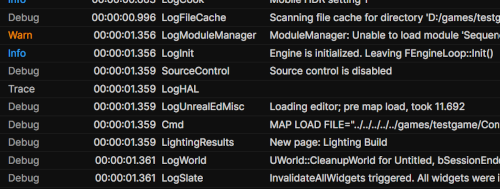
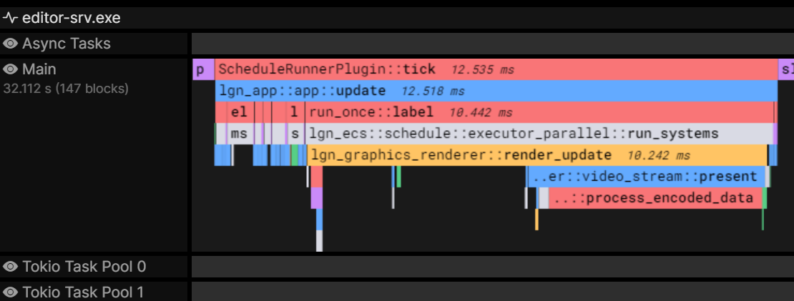

# Legion Performance Analytics

May 2022

---
# Legion Performance Analytics
## Introduction

- Logs, metrics, traces
- Latency, stability, satisfaction
- For local, distributed & cloud native applications

---
# Legion Performance Analytics
## Full stack solution

- One protocol
  * Structured events
  * Time series are not general enough
- One data lake
  * No loose files
- One UI
  * High performance web user interface
  * Tight integration between the logs, metrics & traces

---
# Legion Performance Analytics
## Designed for scale

- High event density: 40 ns overhead / event
  * Platform-specific memory layout
  * The protocol is the memory layout
- Store everything: event batch stored in S3
  * Shallow metadata index in SQL database
- Distributed ingestion
  * Optimized & stateless

---
# Legion Performance Analytics
## Analytics is the new profiling

- Designed for iterating in development
  * Data available as soon as it is sent
  * No nightly indexing job
- Faster reaction time
  * Know the bugs *before* they become problems
- Understand the issue without reproducing it
- Spend time on the worst issues, not the first one you find

---
# Status Quo

Data | Development | Live
--------- | --------- | ---------
Client Logs | loose files | ELK/sampling
Client Metrics | debug overlay | low frequency
Client Traces | interactive profiling | :x:
Server Logs | loose files | ELK 
Server Metrics | :x: | Prometheus, Grafana
Server Traces  | loose files | :x:

---
# Comparison

Capability | Legion Performance Analytics | Splunk/Datadog | Logz | RAD Telemetry
---------- | ---------------------------- | -------------- | ---- | -------------
Logs       | :heavy_check_mark:           | :heavy_check_mark:  | :heavy_check_mark: | :x:
Time series| :heavy_check_mark:           | :heavy_check_mark:  | :heavy_check_mark: | :heavy_check_mark:
Traces     | :heavy_check_mark:           | :heavy_check_mark:  | :x: | :heavy_check_mark:
$calable   | :green_heart:                | :x:  | :heavy_check_mark: | :no_entry:

---
# Architecture

---

