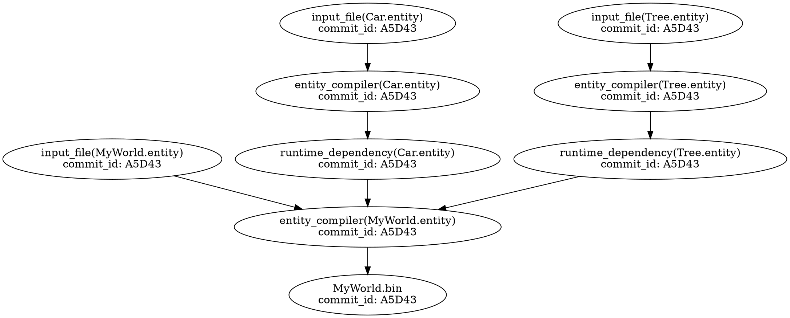
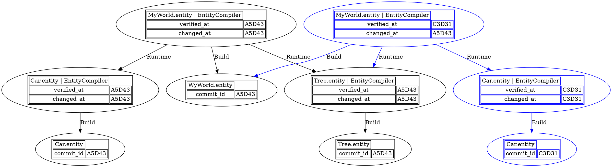
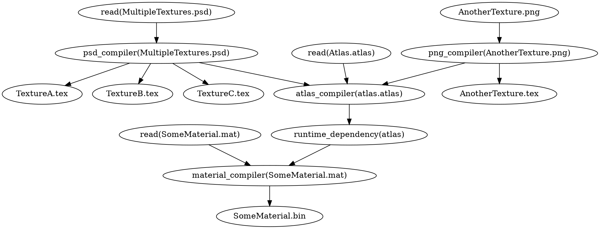

# Data Executor architecture

###### tags: `data-pipeline` `architecture`

## Introduction
This document is the vision of the data executor architecture. As of June 21th 2022, it's not about what's currently in the code, but where we want it to be. This will be a living document and changes are to be expected when we prototype/progress further.

### Nomenclature
* Compiler : A compiler transform data from one format to another.  Examples :
    * Transform a json file from text to runtime binary representation.
* Worker : The process which executes the compiler
* Resource : A jpg, a json, a transformed binary resource
* ResourcePathID : Identifier of a path in a build graph.
    * Considering a build graph where nodes represent *resources* and edges representing *transformations* between resources the `ResourcePathId` uniquely identifies any resource/node in the build graph.
* ContextHash :  the signature of the compilation context. It identifies the context of compilation of the `SourceHash` resource:
    * Type of the resource compiled
    * `CompilerHash` - a compiler-defined value based on:
        * Compiler code version.
        * Compiler data format version.
        * Compilation target - i.e.: Game, Server, etc.
        * Compilation platform - i.e.: Linux, Windows, Console, etc.
        * Compilation locale - i.e.: Language, Region, etc.
        * Data-build process version.
* Bootstrapper : A shell which only job is to spawn the proper runtime.exe. It can be within a website with webasm, an exe on the user machine or on a console.
* Front-end : Can be a Local-User PC, iPhone, Console, WebBrowser/Wasm, user VM in the cloud.

## Scope
In this document, we'll answer the following questions
* How do we compile our data
* Data execution service
* Compiler architecture

### Out-of-scope
* Source Control / Workspaces / Content Store architecture

## Requirements
* Compilation is:
    * **Hermetic** - dependent only on a known set of inputs.
    * **Deterministic** - the result is bit-by-bit reproducible given the same set of inputs.
* Data execution needs to be as fast as possible
* The data executor needs to be reactive
    * When you move an entity in the scene, you expect to see that entity moving with your mouse.
* It needs to handle multiple thousands of assets being built
* It needs to support multiple front-end. Local User PC, Webasm, User-Generated Content on consoles and more.
* It needs to support live patching, live creation of resources for user-generated content.

## Key architectural points
* We discover the dependencies while we compile, there is no prepass to discover dependencies before compiling.
* Data-Build contains the build graph
* We'll have a single (uber) compiler.exe which contains the Data-Build and each individual compiler (texture, mesh, binarization, etc.) 
* We are using a data pull model where a resource is not compiled unless requested.
* The compilers are stateless
* The compilers have 2 types of dependencies
    * 1. **Runtime dependency**: The compiler is telling that it will need those resources at runtime, but does not need them to complete its build.
    * 2. **Build dependency**: The compiler needs those dependencies to complete its build. The compiler will wait for those dependencies to be built before completing.
* Only the data-build can request compilation. When there's a build dependency required by a compiler, it request them to the data-build.
* We'll have one pod per node in kubernetes for the Data Executor workers. Tokio will handle the asynchronous aspects.

## Use case - project with no data cached
Assumption 1 : nothing in the project is built. Therefore, the cache is cold.
Assumption 2 : The editor is part of the runtime, therefore no distinction required between those.

1. A user opens the project `legion-sample` in its frontend
2. Front-end Bootstrapper calls API service (API to be defined) to know the latest commit id of the project & root Resource.
3. Front-end Bootstrapper request runtime.exe & compile.exe from Content Store with the commit id.
4. Front-end Bootstrapper spawn Runtime.exe with ResourcePathId of root of `legion-sample`
5. Front-end Bootstrapper spawn Compile.exe Data-Build to act as an always-alive Orchestrator
    * Orchestrator lifetime is the same as the runtime.
6. Front-end Bootstrapper work is completed
7. Runtime request ResourcePathID of the project to Data-Build with the ContextHash.
8. Data-Build ask Build Output service (API to be defined) if the resource is in the content store
    * In case it's in the content store, Data-Build returns content-store address to runtime. It ends here
9. Build Output does not have the resource.
10. Data-Build spawn a compiler with ResourcePathID using tokio
    * Further optimization is to have long-living workers  to not pay the startup/shutdown costs
    * See Data-Executor service section for long-running builds
11. 

### Data-Executor service
* As a first step, we'll dispatch jobs locally or remotely based on a configuration. A second step is to track analytics on the job running and choose if we go local or remote based on heuristic.

* Data-Build needs observability. How much has been built, how much is building. Ideally we'll end-up doing a Build monitor like incredibuild.

## Build Graph
We need to persist the build graph in the indexer for each commits. This way anyone syncing a commit have the up-to-date build graph. If the build graph is not in the indexer, we'll need to do a build graph invalidation.

### Build Graph invalidation / incremental compilation
#### Documentation : Papers / Articles / Videos
[How to recalculate a spreadsheets](https://lord.io/spreadsheets/)
This is the simplest explanation of all and showcase the different algorithms.

[Build system a la carte](https://www.microsoft.com/en-us/research/uploads/prod/2020/04/build-systems-jfp.pdf)
Very comprehensive paper on the state of the art of build systems and categorization of different types of build system. This is the first paper that made the connection between Excel and a build system.

[Incremental Compilation | Rust Blog (rust-lang.org)](https://blog.rust-lang.org/2016/09/08/incremental.html)
[Wikipedia](https://en.wikipedia.org/wiki/Incremental_computing)
[Self-Adjusting Computation](https://www.cs.cmu.edu/~rwh/students/acar.pdf)

Salsa video : https://www.youtube.com/watch?v=vrnNvAAoQFk

https://www.mpi-sws.org/tr/2015-002.pdf
The key idea behind self-adjusting computation is to divide a computation into sub-computations, and maintain a dependence graph between sub-computations

Facebook Buck future is in Rust : https://developers.facebook.com/blog/post/2021/07/01/future-of-buck/
Based on Adapton & Salsa algorithms

### Graph
Iinitial state after first build on commit id A5D43

#### Source is modified
Request to build `MyWorld.entity | EntityCompiler` on new commit id C3D31. 

Step 1 : Find the closest ancestor build graph for our CL & this node with same build params. In this case the ancestor is A5D43.
Step 2 : Source control tells us that Car.entity source file changed between A5D43 and C3D31.

Note that a runtime dependency would not invalidate the nodes referencing it. It will just update the verified_at up to the top.

#### MyWorld.entity is modified
Request to build `MyWorld.entity | EntityCompiler` on new commit id 99D21. 

Step 1 : Find the closest ancestor build graph between our commit & this node. In this case the ancestor is C3D31.
Step 2 : Source control tells us that `MyWorld.entity` source file changed between C3D31 and 99D21. The Car has been deleted and a house has been added.

``` graphviz
digraph {
0 [ label = 
    <<table>
        <tr><td>MyWorld.entity | EntityCompiler</td></tr>
        <tr><td>verified_at</td><td>A5D43</td></tr>
        <tr><td>changed_at</td><td>A5D43</td></tr>
    </table>> ]
1 [ label = 
    <<table>
        <tr><td>WyWorld.entity</td></tr>
        <tr><td>commit_id</td><td>A5D43</td></tr>
    </table>> 
    ]
2 [ label = 
    <<table>
        <tr><td>Car.entity | EntityCompiler</td></tr>
        <tr><td>verified_at</td><td>A5D43</td></tr>
        <tr><td>changed_at</td><td>A5D43</td></tr>
    </table>> 
    ]
3 [ label = 
    <<table>
        <tr><td>Car.entity</td></tr>
        <tr><td>commit_id</td><td>A5D43</td></tr>
    </table>> 
    ]
4 [ label = 
    <<table>
        <tr><td>Tree.entity | EntityCompiler</td></tr>
        <tr><td>verified_at</td><td>A5D43</td></tr>
        <tr><td>changed_at</td><td>A5D43</td></tr>
    </table>> 
    ]
5 [ label = 
    <<table>
        <tr><td>Tree.entity</td></tr>
        <tr><td>commit_id</td><td>A5D43</td></tr>
    </table>>
    ]
6 [ label = 
    <<table>
        <tr><td>MyWorld.entity | EntityCompiler</td></tr>
        <tr><td>verified_at</td><td>C3D31</td></tr>
        <tr><td>changed_at</td><td>A5D43</td></tr>
    </table>> 
    ]
7 [ label = 
    <<table>
        <tr><td>Car.entity | EntityCompiler</td></tr>
        <tr><td>verified_at</td><td>C3D31</td></tr>
        <tr><td>changed_at</td><td>C3D31</td></tr>
    </table>>
    ]
8 [ label = 
    <<table>
        <tr><td>Car.entity</td></tr>
        <tr><td>commit_id</td><td>C3D31</td></tr>
    </table>>
    ]
9 [ label = 
    <<table>
        <tr><td>MyWorld.entity | EntityCompiler</td></tr>
        <tr><td>verified_at</td><td>99D21</td></tr>
        <tr><td>changed_at</td><td>99D21</td></tr>
    </table>>
    color=blue 
    ]
10 [ label = 
    <<table>
        <tr><td>House.entity | EntityCompiler</td></tr>
        <tr><td>verified_at</td><td>99D21</td></tr>
        <tr><td>changed_at</td><td>99D21</td></tr>
    </table>>
    color=blue
    ]
11 [ label = 
    <<table>
        <tr><td>MyWorld.entity</td></tr>
        <tr><td>commit_id</td><td>99D21</td></tr>
    </table>>
    color=blue
    ]
12 [ label = 
    <<table>
        <tr><td>House.entity</td></tr>
        <tr><td>commit_id</td><td>99D21</td></tr>
    </table>>
    color=blue
    ]
    
    0 -> 1  [ label = "Build" ]
    0 -> 2  [ label = "Runtime" ]
    0 -> 4  [ label = "Runtime" ]
    2 -> 3  [ label = "Build" ]
    4 -> 5  [ label = "Build" ]
    6 -> 1  [ label = "Build" ]
    6 -> 7  [ label = "Runtime" ]
    6 -> 4  [ label = "Runtime" ]
    7 -> 8  [ label = "Build" ]
    9 -> 11 [ label = "Build" color=blue ]
    9 -> 4  [ label = "Runtime" color=blue ]
    9 -> 10 [ label = "Runtime" color=blue ]
    10 -> 12 [ label = "Build" color=blue ]
}
```

### More complex graph

### Questions to answer
Is the Data-Build querying the database to know if the resource is already built or it's better to build them?

### API
API : Always take a vector of resource path id, so there's no cases where the compiler ask resources in a foor loop and waits for each iteration to start the next one. Go wide.

### Workers vs Compilers
If you have a single worker, we could easily starve it off. The worker gets a compilation, the compilation requires another compilation and now there's no more worker to do the compilation. We cannot use async/await if the worker is a separate exe than the compiler.

#### Option 1 : Recursion inside compiler.exe

One compiler.exe recursively builds all it's build dependencies, sequentally.

**Pro** : 
* Simple to implement
* Same implementation between local and cloud

**Con** : Might be super slow

#### Option 2 : Locally merge Worker.exe and Compiler.exe

Locally "worker.exe" is in fact Compiler.exe, and uses Tokio to await on the additional work. It means that the worker can pull another compilation to do and execute it. On the cloud, we keep the worker.exe that spawns Compiler.exe and get starve. This is not an issue on the cloud because the unused processing power will be reused by other processes and we should have enough workers on the cloud to never starve.

In other words, worker.exe is scheduling "compiler futures". It is a single executable containing compiler and scheduling code.
**Pros**
- Can be fast

**Cons**
- Different behaviour between local and remote workers.
- If shit hits the fan, we could theorically starve the cloud

#### :point_right: Option 3 : Compiler.dll

Worker.exe uses compiler.dll to execute the compilation. We can use the full power of async/await to never starve locally and/or on the cloud.

The DLL interface would be very slim : fn compile(resource_manager);

**Pros**
- Same architecture locally / cloud
- Never starve
- Fast

**Cons**
- Possible DLL Hell. Any API change to the DLL would make the exe incompatible with the DLL.

### 1 Worker, multiple compilers
The runtime would have a single worker with multiple threads which uses multiple compilers. The cloud would also have a single  worker for it's pod with multiple workers, dependending on the number of CPU available.

## What happens when a compiler has an unbuilt build dependency
Let's say you have resourceA that needs a ResourceB that is the result of a compilation which has not been built previously.

#### Option 1 : Recursion inside the compiler
Bypass the queue and use the current worker to build all the recursive dependencies.

**Pros**
- Simple to implement

**Cons**
- With lots of dependencies, we're not benefiting from all the power
- Possible scheduling conflicts where too much jobs ends up in a pod

#### Option 2 : Local Queue Manager
All compilation requests goes through a local queue manager. This local queue is situated in the user VM and lives as long as the runtime is living.

The compilation request gets added to the local queue. The local queue manager is responsible to dispatch it back to the data executor service if required. 

**Pros**
- Information is centralized about what needs to be built
- Local build graph data centralized

**Cons**
- Possible "chattyness" between local queue manager and workers.

#### Option 3 : No local compilation
Everything goes through the data execution services

**Pros**
- Information is centralized about what needs to be built
- Build graph data is centralized and shareable between users

**Cons**
- Latency would make some compilers impossible to be reactive. For example, if we have a compiler which moves an object, a 200ms delay would be very noticeable for the user. We are fully expecting some requests to take multiple seconds due to higher workloads.
- We do not benefit from user vm vcpu allocation

#### :point_right: Option 4 : Data execution service associated to the compiler
The requested data goes through a Data Execution provider.

* Locally the data execution provider is a queue in-memory with a local status db. 
* On AWS, the data execution provider is done via a service that communicates via OpenAPI, uses the global status db and [SQS](https://aws.amazon.com/sqs/) 

When a compiler request a compilation build dependency, it always uses the data execution service provider associated to the compilation. This means that if the execution is done locally, the compilation request will go in the local queue and if you are compiling on AWS, the compilation request would go in the Data execution service.

In local there's a broker that choose if there is a need it  to dispatch work remotely.
As a starter, we plan on sending Textures, meshes, animations, shaders remotely. We'll also send the local overflow to the remote data execution provider. i.e. we have 1000 compilation requests locally, but only 8 compilation in-progress, we might send 950 tasks to AWS.

For later,it would also be possible to do the reverse, having the broker seeing that local provider has no more work to do and fetch back jobs that has been dispatched remotely.

The compiler is responsible to return the graph of all build dependencies, recursively.

The compiler is responsible to call it's status DB to mark the progress of it's job.

**Pros**
- :point_right: Jalal approved
- Solves nicely the recursion challenges
- This design scales horizontally
- If we add a new cloud service (Azure, Google Cloud Platform), we only need to create a new provider and update the broker.

**Cons**
- We need to create 2 providers that works differently (Local & AWS)

## Asset specializations
Some assets like voice, text, and textures needs to be localized or have a

### Where does compiler live?
A game project has at least 2 crates
1. Edition / Compilers
2. Game runtime

The compiler code lives in Edition crate in a dependant crate of edition.

